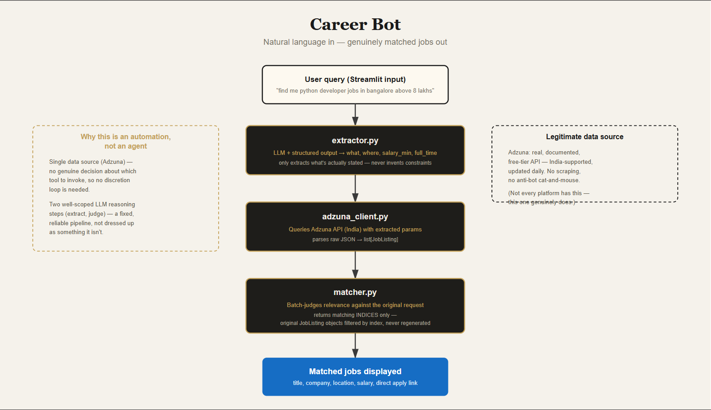

# Career Bot

A natural-language job search tool that understands what you're actually asking for, searches real listings, and filters out anything that's not a genuine match — before showing you a single result.

No keyword-matching, no scrolling past irrelevant postings. Type what you want in plain English; get back only the jobs that actually fit.

---

## The problem this solves

Job search platforms are built around rigid filters — dropdowns, checkboxes, exact keyword matching. Searching "python developer" surfaces listings that mention Python once in passing, buried among a hundred that aren't relevant at all. This tool inverts that: describe what you want the way you'd say it to a person, and let an LLM do the actual work of understanding intent and judging genuine fit — the same reasoning a good recruiter would apply, at the scale of an API call.

---

## What it does

1. **Understands the request** — parses a plain-language query ("find me remote python developer jobs paying above 8 lakhs") into structured search parameters, extracting only what's actually stated — never inventing a location, salary, or constraint that wasn't mentioned
2. **Searches real listings** — queries Adzuna's job aggregator API (India-supported, updated daily) with the extracted parameters
3. **Judges genuine relevance** — batch-evaluates the returned listings against the original request, filtering out anything that superficially matches on keywords but isn't actually the right fit (wrong seniority, wrong location, different role entirely)
4. **Presents real results** — title, company, location, salary (when available), and a direct link to apply — nothing regenerated or paraphrased by the LLM, so links are always exactly correct

---

## Why this architecture

### Legitimate data source, not a scraping workaround
Adzuna offers a genuine, documented, free-tier API with real India coverage — no scraping, no anti-bot cat-and-mouse. Worth stating plainly: platforms without a legitimate API path (many real estate portals, for instance) aren't worth fighting with scrapers when a clean alternative exists elsewhere in the same problem space.

### An automation, not an agent — and that's a deliberate, correct choice
There's no tool-calling discretion loop here, and there doesn't need to be — with a single job data source, there's no genuine decision about *which* tool to invoke. Calling this "agentic" would be dressing up a clean, reliable pipeline in unearned complexity. The real reasoning happens in two well-scoped LLM steps: extraction and relevance judgment.

### The matcher returns indices, never regenerated data
The relevance-judgment step tells the pipeline *which* listings matched — by index — rather than having the LLM reproduce job data (titles, and critically, application links) itself. LLMs are unreliable at reproducing long exact strings verbatim; a single corrupted character in a redirect link silently breaks the tool's entire value. Filtering the original, untouched data by index instead of regenerating it removes that risk entirely.

### Batch relevance judgment, not per-listing
Listings from one search are similar enough in shape that judging them together in a single call is both cheaper and sufficient — no meaningful quality loss versus scoring each individually, unlike more heterogeneous content where per-item judgment matters more.

## Architecture flowchart



---

## Tech stack

| Layer | Technology |
|---|---|
| Query understanding / relevance judgment | LangChain + Groq (Llama 3.3 70B) |
| Structured output | Pydantic + `.with_structured_output()` |
| Job data | Adzuna API (India) |
| Interface | Streamlit |

---

## Project structure

```
career_bot/
├── extractor.py       # Parses natural-language query into structured search params
├── adzuna_client.py   # Queries Adzuna, parses results into JobListing objects
├── matcher.py         # Batch-judges relevance, returns matching indices
├── app.py             # Streamlit interface
├── config.yaml
├── requirements.txt
└── .env               # API keys (gitignored)
```

---

## Setup

```bash
python -m venv venv
venv\Scripts\activate        # Windows
pip install -r requirements.txt
```

Create `.env`:
```
GROQ_API_KEY=your_groq_api_key
ADZUNA_APP_ID=your_adzuna_app_id
ADZUNA_APP_KEY=your_adzuna_app_key
```

Run:
```bash
streamlit run app.py
```

---

## Known limitations

- Single data source (Adzuna) — broader coverage would mean adding sources like Jooble or Reed, and genuinely would introduce real agentic tool-selection if multiple sources need choosing between

- Stateless — no memory across searches, no resume-based matching, no saved searches or alerts

- Relevance judgment depends on Adzuna's description excerpt quality, which is sometimes truncated

---

## Author

Built by **Aryan Dhawan** — AI/ML engineer, building independently under [Tandem AI Labs](https://tandem-ai.tech).